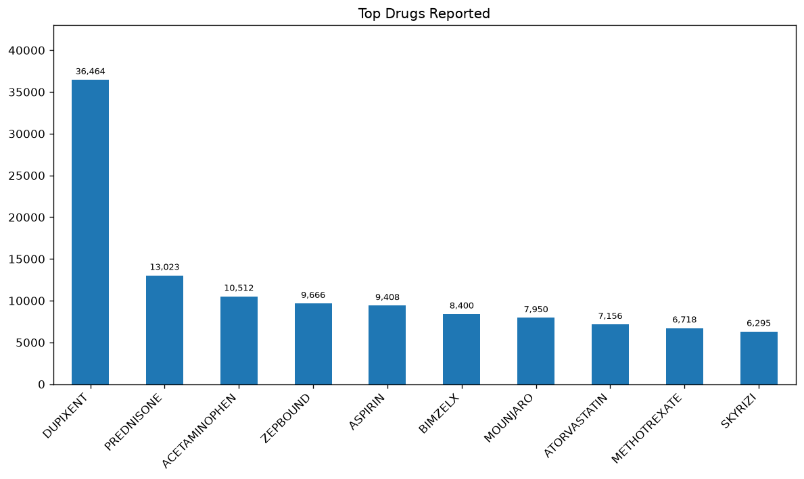
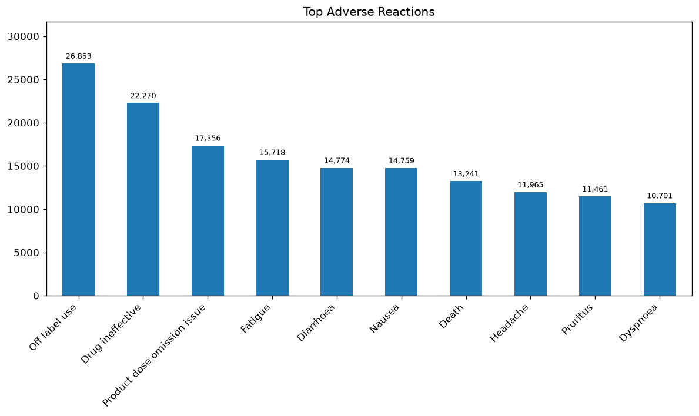
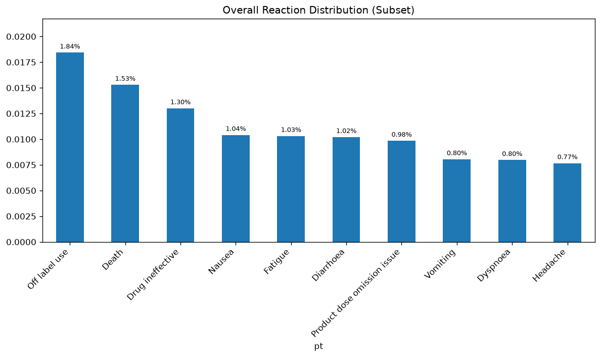
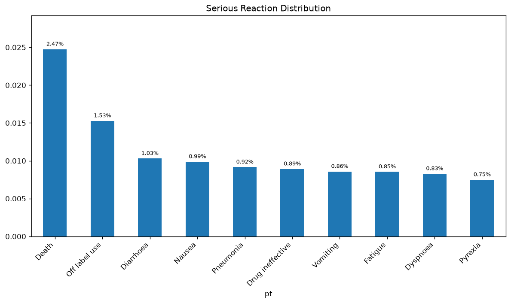
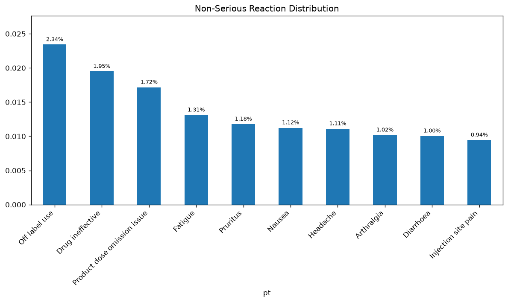

# FDA FAERS Q4 2025

These charts count each drug once per case and each reaction once per case. Dupixent is the most reported drug, named in 36,464 cases. Off-label use is the most reported reaction, in 26,853 cases. Death is reported in 13,241 cases.

The **pre** charts in `archive/` used the old count. The **current** charts in `result/` use the corrected count.

## Why the pre charts were wrong

The pre charts multiplied every drug on a report by every reaction on that report. A case with many drugs and many reactions was counted hundreds of times.

Methotrexate cases in this file list about 42 drugs and 12 reactions. Dupixent cases list about 3 drugs and 3 reactions. The multiplication pushed methotrexate, Actemra, and sulfasalazine to the top of the pre drug chart. Dupixent was far down that chart even though more cases name it.

The pre reaction chart has the same problem. Off-label use shows about 389,000 there. The current chart shows the real case count: 26,853.

This quarterly file already has one row per case, 385,288 in total. The new order comes from the counting rule.

## Current drug ranking

A count here is the number of cases that name the drug. It is not proof that the drug caused the event.

Dupixent, Zepbound, Bimzelx, Mounjaro, and Skyrizi are the main suspected drug in most of the cases that name them. Prednisone, acetaminophen, aspirin, atorvastatin, and methotrexate usually are not. Aspirin is the main suspect in 90 of the 9,408 cases that name it.

| Rank | Drug | Cases | Main suspect in most cases |
| --- | --- | ---: | --- |
| 1 | Dupixent | 36,464 | Yes |
| 2 | Prednisone | 13,023 | No |
| 3 | Acetaminophen | 10,512 | No |
| 4 | Zepbound | 9,666 | Yes |
| 5 | Aspirin | 9,408 | No |
| 6 | Bimzelx | 8,400 | Yes |
| 7 | Mounjaro | 7,950 | Yes |
| 8 | Atorvastatin | 7,156 | No |
| 9 | Methotrexate | 6,718 | No |
| 10 | Skyrizi | 6,295 | Yes |

The pre chart is `archive/TDR.png`.

## Current reaction ranking

Each number is the number of cases that report the reaction.

| Rank | Reaction | Cases |
| --- | --- | ---: |
| 1 | Off label use | 26,853 |
| 2 | Drug ineffective | 22,270 |
| 3 | Product dose omission issue | 17,356 |
| 4 | Fatigue | 15,718 |
| 5 | Diarrhoea | 14,774 |
| 6 | Nausea | 14,759 |
| 7 | Death | 13,241 |
| 8 | Headache | 11,965 |
| 9 | Pruritus | 11,461 |
| 10 | Dyspnoea | 10,701 |

The pre chart is `archive/ADR.png`.

## Serious and non-serious cases

The subset charts use the same 5,000 serious cases and 5,000 non-serious cases as the pre charts. A serious case has at least one of these outcome codes: death, life-threatening, hospitalisation, disability, congenital anomaly, or required intervention.

The percentages are shares of reaction terms in that sample. They are not shares of cases. A case usually lists several reactions, so Death can be common among serious cases and still be a small share of all the terms those cases list. Death is in 13,037 of 108,869 serious cases. In the serious sample it is 2.47% of reaction terms.

The sample is half serious and half non-serious. The full file is not. It has 108,869 serious cases and 276,419 non-serious cases, so the "overall" bars are not the full-file rate. Another 109,473 cases are coded only as other medically important and stay in the non-serious group.

In the current sample:

- Serious reactions are led by Death at 2.47%, then off-label use at 1.53% and diarrhoea at 1.03%.
- Non-serious reactions are led by off-label use at 2.34%, drug ineffective at 1.95%, and product dose omission at 1.72%.
- Across the mixed sample, off-label use is 1.84% and Death is 1.53%.

The pre charts are `archive/overall_subset_reactions.png`, `archive/serious_subset_reactions.png`, and `archive/non_serious_subset_reactions.png`.

`reaction_comparison_table.csv` is the pre table. A blank cell means the term missed that column's top 10. It does not mean the share was zero.

## Scripts

- `faers_analysis.py` builds the current full-file charts.
- `faers_outc_analysis.py` builds the current serious and non-serious charts.

## Data

The Q4 2025 ASCII files are not in this repo. Download them from the FDA FAERS public dashboard: https://fis.fda.gov/extensions/FPD-QDE-FAERS/FPD-QDE-FAERS.html

## Requirements

pandas, matplotlib
